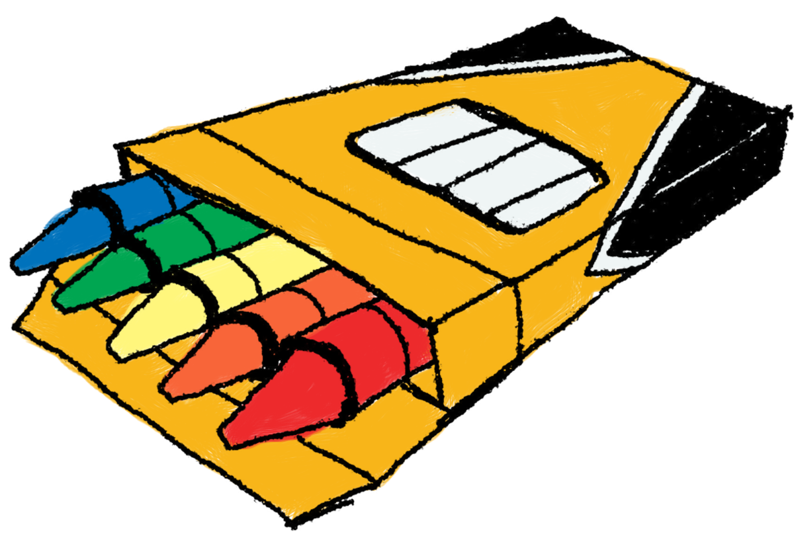

<!-- README.md is generated from README.Rmd. Please edit that file -->

```{r, include = FALSE}
knitr::opts_chunk$set(
  collapse = TRUE,
  comment = "#>",
  fig.path = "man/figures/README-",
  out.width = "100%"
)
```

# crayons  


<!-- badges: start -->
[](https://www.repostatus.org/#active)
[](https://www.tidyverse.org/lifecycle/#experimental)
[](https://cran.r-project.org/package=crayons)
[](https://cranchecks.info/pkgs/crayons)
[](https://github.com/r-hub/cranlogs.app)
<!-- badges: end -->

Get your favorite crayons ready for all your experimental coloring needs in RStudio
and R.

Please follow the installation steps carefully and take a gander at the 
instruction manual below for proper handling.

## Installation

You can install the development version from [GitHub](https://github.com/) with:

```{r, eval = FALSE}
install.packages("devtools")
 
# Location of the crayon boxes... 
devtools::install_github("etam4260/crayons")
```

The coloring tool(crayons) are different on Mac OS versus Windows and 
therefore the features are different.

## Instruction Manual

This is how to ask for a crayon box and open it...

```{r, eval=FALSE}
# Asking the teacher for crayons...
library(crayons)

# Opening the crayon box
crayons()
```

This will open up a viewer pane in your RStudio session as an interactive 
color creation tool. 

Swap crayons by clicking on each box for access to the cart of options.


1) Press the add buttons or drag and drop colors to interactive text canvas.

2) Click on the colors themselves to swap to different colored crayons.

3) Switch from HEX, COLOR, and RGB tabs to see how they are represented in R code.

4) Press the eraser button to erase the last entry
 
5) Drag and drop the eraser onto the text canvas to erase everything.

**What is currently shown on the text canvas is also available in your computer's paste command**

## Demo


## Moar Crayons

The current crayon box only comes with **8**. Moar crayons will be 
available in future updates!

**Upcoming features:**

* Ability to ask for more crayons and crayon boxes.
* Draggable crayons to different areas of your viewer desk for organization.

* Paintbrush cursor
* Erasing animation

* A new function for interactive plotting directly in the viewer tab. 
(Move plots in and out that are currently located in the Plots tab).

* Ability to specify to allow access to the computer copy command. 

* Ability to save color palletes to user's RProfile so it can be saved and loaded in
from other R sessions.
* A color loading bar to have a visual cue of what colors are currently 
loaded into the clipboard.

* Proper scaling of the Viewer UI to support certain screen sizes as well as the
appropriate sizing of the Zoom.

## Disclaimers

* This is a WIP so please report any bugs to https://github.com/etam4260/crayons/issues
* Any feedback is appreciated! Want a new feature? Just ask!
