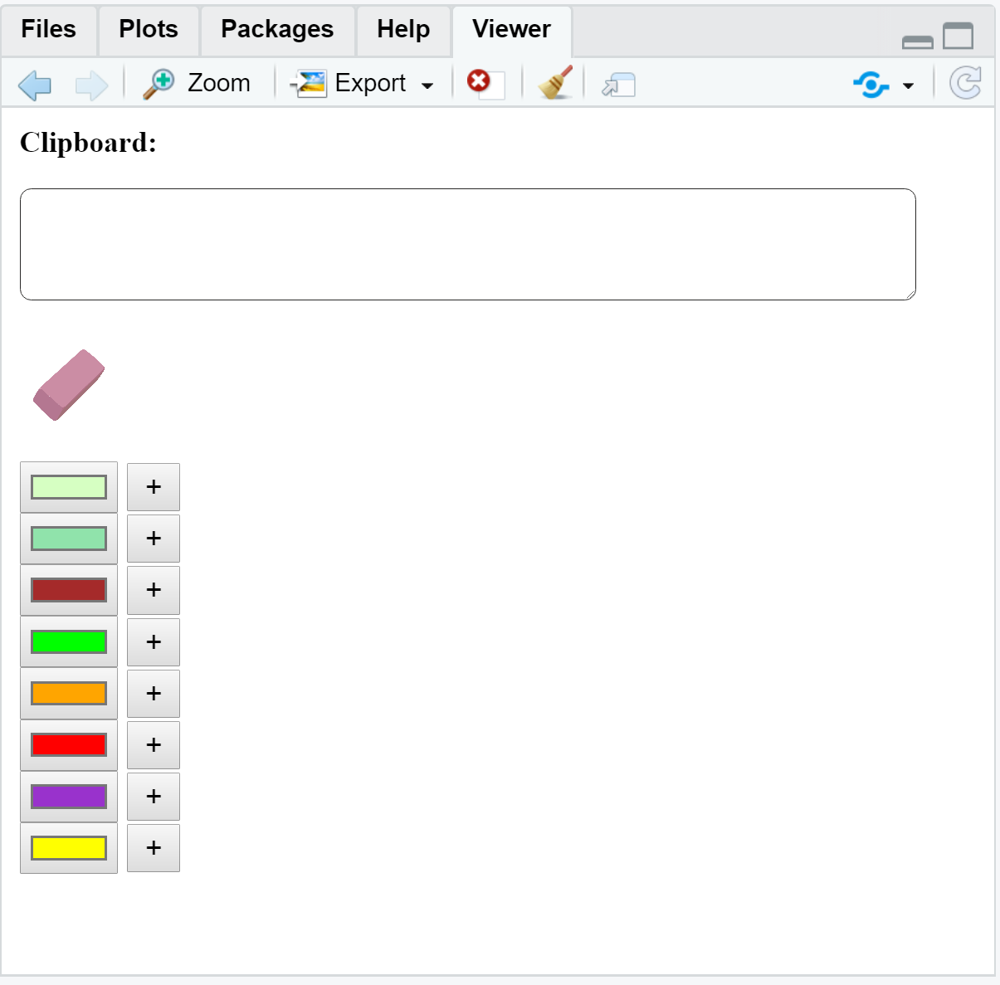
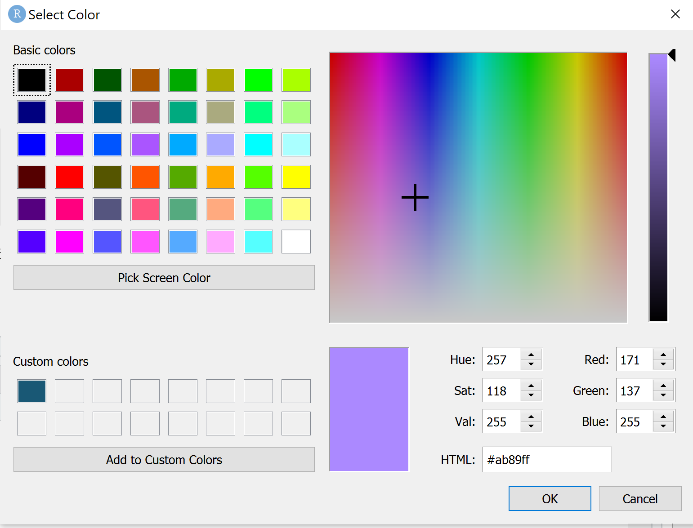
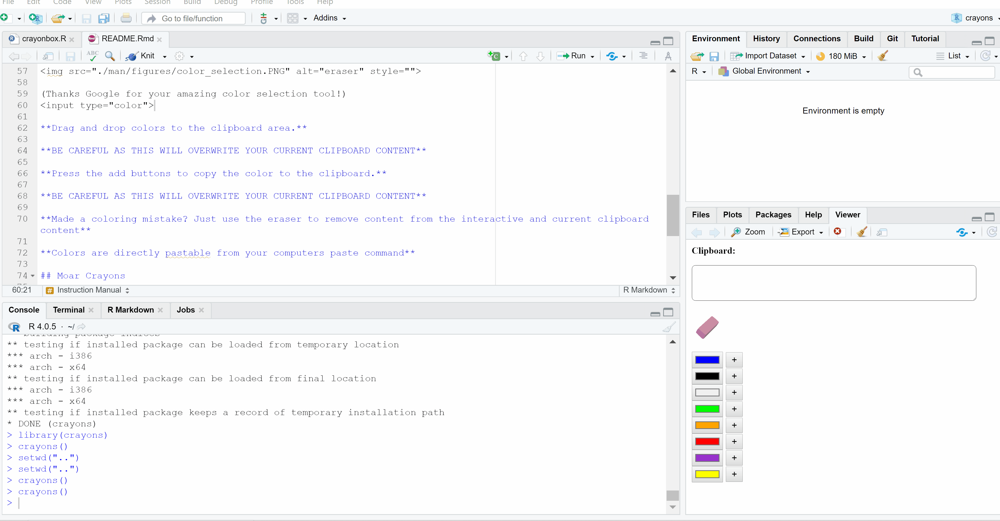

<!-- README.md is generated from README.Rmd. Please edit that file -->

# crayons 

<!-- badges: start -->

[](https://www.repostatus.org/#active)
[](https://www.tidyverse.org/lifecycle/#maturing)
[](https://github.com/etam4260/crayons/actions)
[](https://codecov.io/gh/etam4260/crayons?branch=main)
[](https://cran.r-project.org/package=crayons)
[](https://cranchecks.info/pkgs/crayons)
[](https://github.com/r-hub/cranlogs.app)
<!-- badges: end -->

Get your favorite crayons ready for all your experimental coloring needs
in R.

Please follow the installation steps carefully and take a gander at the
instruction manual below for proper handling.

## Installation

You can install the development version from
[GitHub](https://github.com/) with:

``` r
install.packages("devtools")
 
# Location of the crayon boxes... 
devtools::install_github("etam4260/crayons")
```

## Instruction Manual

This is how to get yourself a crayon box.

``` r
# Asking the teacher for crayons...
library(crayons)

# Opening the crayon box
crayons()
```

This will open up a viewer pane in your RStudio session as an
interactive color creation tool.



Swap crayons by clicking on each box for access to the cart of options.



(A shout out to Google for your amazing HTML color selection tool!)
<input type="color">

## Demo



**Drag and drop colors to the interactive text canvas.** **Press the add
buttons to copy the color to the clipboard and the screen.**

**BE CAREFUL AS THESE OPERATIONS WILL OVERWRITE YOUR CURRENT COMPUTER
CLIPBOARD CONTENT** CTRL+C

**Made a coloring mistake? Just use the eraser to remove content from
the interactive and current clipboard** Press it to erase the last item.
Drag and drop it onto the text canvas to erase everything.

**Colors are directly pastable from your computer’s paste command**

## Moar Crayons

The current crayon box only comes with **8**. Moar crayons will be
available in future updates!

Upcoming features:

-   Ability to ask for more crayon boxes
-   Draggable crayons to different areas of your viewer desk
-   A new function for interactive plotting directly in the viewer tab.
    (Move plots in and out that are currently located in the Plots tab)
-   Paintbrush cursor
-   Erasing animation

## Disclaimers

-   This is a WIP so please report any bugs to
    <https://github.com/etam4260/crayons/issues>
-   Any feedback is appreciated! Want a new feature? Just ask!
